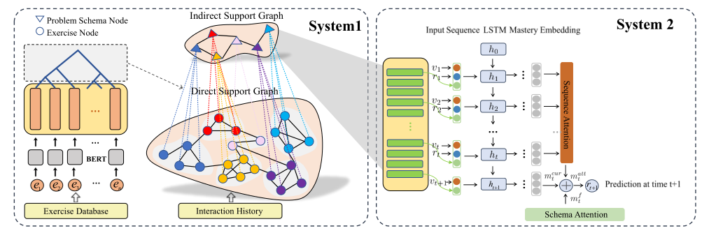

# HGKT
The implementation of the paper [Introducing Problem Schema with Hierarchical Exercise Graph for Knowledge Tracing](https://arxiv.org/abs/2006.16915).

The architecture of the HGKT is as follows:



## Setup                                                                                                                                                                                                                                                                                                                                                                                                                                                                                                                                                                                                                                                                                                                                                                                                                                                                                                                                                                                                                                                                                                                                                                                                                                                                                                                                                                                                                                                                                                                                                                                                                                                                                                                                                                                                                                                                                                                                                                                                                                                                                                                                                                                                                                                                                                                                                                                                                                                                                                                                                                                                                                                                                                                                                                                                                                                                                                                                                                                                                                                                                                                                                                                                                                                                                                                                                                                                                                                                                                                                                                                                    

To run this code you need the following:

- a machine with GPUs
- python3
- numpy, pandas, scipy, scikit-learn and torch packages:
```
pip3 install numpy==1.17.4 pandas==1.1.2 scipy==1.5.2 scikit-learn==0.23.2 torch==1.4.0
```

**Note that don't use pandas with 0.23.4 version, because it will cause bugs when perform the following command in the processing.py file**.
    df.groupby('user_id', axis=0).apply(get_data)

## Dataset
To be released

## Training the model
To be released
